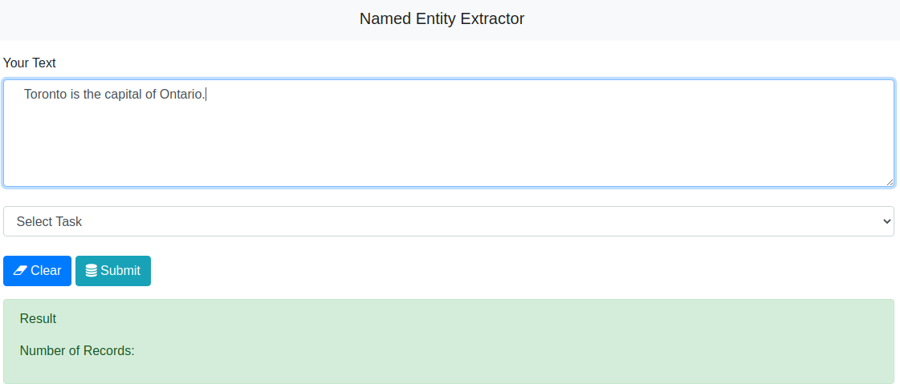
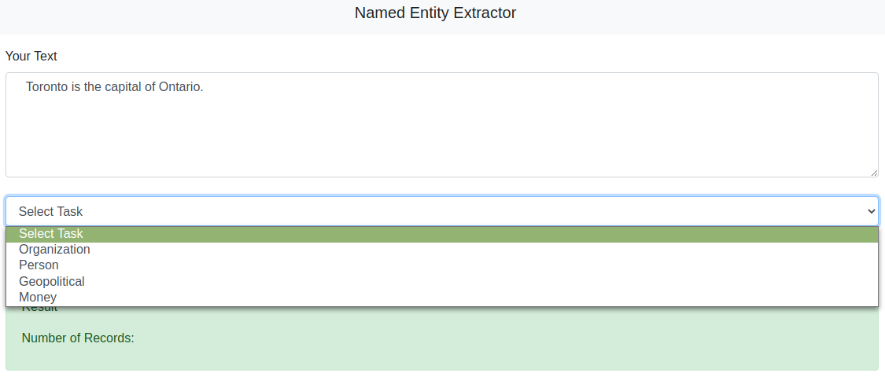
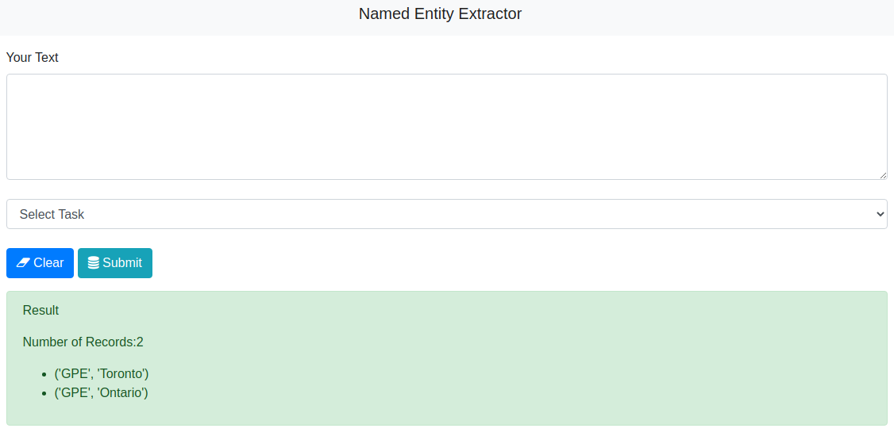

# flaskAPI-NER
Named-entity recognition model deployment

## Purpose

The purpose of this project is the deployment of a NLP model and providing access to it through a web API.

## Components

The components of the web service API are the following:

* spacy
* flask

## Deployment

From the project folder, implement the following steps:

1. Create a virtual environment

	`conda create --name <venv> python=3.9.6 -y`

2. Enable the new virtual enviroment:

	`conda activate <venv>`

3. Install the Flask web server:

	`conda install flask=1.1.2 -y`

4. Install the spacy NLP library:

	`conda install spacy=2.3.5 -y`

5. Install the English core component for spacy:

	`conda install -c conda-forge spacy-model-en_core_web_md -y`

6. Set the FLASKAPP environemtn variable to app.py:

	`export FLASKAPP=app.py`

7. Start the flask web server:

	`flask run`

## Operation

1. Click on the URL that was provided by the `flask run` step above:

	[Named Entity Recognition](http://127.0.0.1:5000/)

2. In the text area, enter some text:

	

3. Select the named entity of interest. The possible choices are *Organization* , *Person*, *Geopolitical*, and *Money*.

	

4. After hitting the `Submit` button, the text is analyzed by the spacy NLP model and a list of entities matching the selected type are returned.

	

